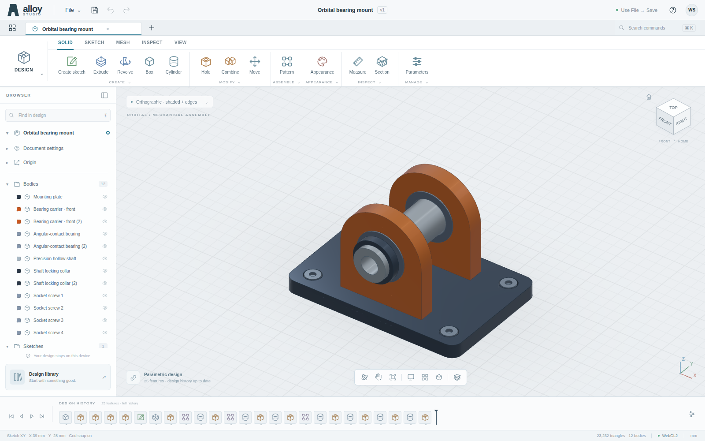

# Alloy Studio

[Launch Alloy Studio](https://wieslawsoltes.github.io/AlloyStudio/) · [Download standalone HTML](https://wieslawsoltes.github.io/AlloyStudio/AlloyStudio.html)

**A dependency-free, Fusion-inspired parametric mesh CAD workspace for the browser.**

Version 0.1.0 · MIT · plain HTML, CSS, and JavaScript · WebGPU-first with a WebGL2 fallback.

This is a working modeling application, not a bitmap mockup. Its independent polygonal solid kernel generates and edits actual geometry. It is **not a complete Autodesk Fusion replacement, an analytic B-rep kernel, or a manufacturing-certified CAD system**. See the limitations below before using exported geometry.



## Run

The release includes `dist/AlloyStudio.html`, a single self-contained file with its CSS, application code, and worker code embedded. There are no CDN requests, runtime packages, fonts, external models, telemetry, account requirements, or back-end services.

For predictable worker, storage, and WebGPU behavior, serve it from localhost or HTTPS:

```sh
cd alloy-studio
python3 -m http.server 8000
```

Open `http://localhost:8000/dist/AlloyStudio.html` in your browser. To work directly on the ES modules, open `http://localhost:8000/` instead. The single-file build can also be opened directly; GPU availability, workers, and persistence then depend on the browser's local-file policies.

The bottom-right badge reports the **actual** renderer. WebGPU is attempted first. Missing adapters, initialization errors, and unsupported contexts select the native WebGL2 implementation instead. Append `?renderer=webgl` to force that path. The app needs one of these two graphics APIs.

The current browser session is locally autosaved with IndexedDB when available. **File → Save** exports an editable `.alloy` project; use that for durable backups. Opening a sample or project replaces the active workspace. Storage denial is shown as “Use File → Save,” not as a successful autosave.

## What works

| Area | Implemented behavior |
| --- | --- |
| Workspace | Ribbon tabs, body/sketch browser, visibility controls, search, command palette, inspector, navigation bar, view cube, editable history timeline |
| Solid creation | Boxes with optional rounded rectangular footprints; cylinders, spheres, tori; positive/negative sketch extrusions; full/partial revolutions |
| Solid editing | BSP union, difference, intersection; retained Boolean tools; cylindrical holes and counterbores on X/Y/Z; translation, XYZ Euler rotation, positive uniform scale |
| Patterns | Linear body patterns on X/Y/Z; circular body patterns about world Z |
| Sketches | XY/XZ/YZ planes; drag rectangles and circles; closed polylines; grid snapping; numeric rectangle/circle dimensions; editable polygon vertex coordinates |
| Parametrics | Named parameters, safe expression parser, feature references, downstream regeneration, editable source features, suppression, rollback/replay, undo/redo |
| Viewport | Orbit/pan/pointer-anchored zoom; orthographic/perspective; shaded, shaded-and-edges, and occluded wireframe-style display; picking and selection; move-axis gizmos |
| Inspection | Approximate mesh volume, area, material-density mass and bounds; surface-point distance measurement; uncapped section clipping; exploded presentation |
| Materials | Eight built-in metal/polymer/elastomer appearances with editable per-body assignment |
| Import | Editable `.alloy`/JSON projects; binary/ASCII STL; OBJ geometry, interpreted in millimeters |
| Export | Editable `.alloy`; binary STL; OBJ; projected-edge SVG; viewport PNG |
| Samples | Orbital bearing mount: 25 features, 12 bodies, 23,232 triangles; precision flange; blank workspace |

STL and OBJ export the selected body, or all visible bodies when nothing is selected. Mesh formats do not preserve the feature history. SVG is a projected edge illustration: hidden edges are included, and it is explicitly not to scale. Section and explode are display effects, not exported solid operations.

## First modeling workflow

1. Open **File → New design**, or use **Design library → Blank design**.
2. Press **S**, draw a rectangle, enter its width and height in the sketch palette, and choose **Finish sketch**.
3. Press **E**, enter an extrusion distance, then **Apply**.
4. Select the solid, press **H**, enter the cutter position/radius/depth, then **Apply**. The hole is an actual Boolean subtraction.
5. Click an earlier feature in the timeline to edit its dimensions. Right-click a timeline feature for suppression and rollback. Save a `.alloy` file to preserve the editable model.

For an intersecting cutter or additive body, create overlapping bodies and use **Combine**. Patterns retain the original body and create additional bodies. Round-corner boxes are not arbitrary edge fillets.

### Keyboard and navigation

| Action | Input |
| --- | --- |
| Sketch / rectangle / circle / polyline | S; inside a sketch: R / C / L |
| Extrude / box / hole / move | E / B / H / M |
| Appearance / measure | A / I |
| Fit / projection / grid | F / P / G |
| Command palette | Ctrl/Cmd+K |
| Save project | Ctrl/Cmd+S |
| Undo / redo | Ctrl/Cmd+Z / Ctrl/Cmd+Shift+Z |
| Orbit | Right drag, or Shift+middle drag |
| Pan / zoom | Middle drag / wheel |
| Deselect / cancel current gesture | Escape |

## Parameters

All geometry is modeled in millimeters; angular fields use degrees. Enter numbers or formulas such as:

```text
baseWidth / 2
plate + 4
2 * inch
sqrt(16) + 2 * cm
sin(30) * 40
```

The parser supports `+ - * / ^`, parentheses, named dependencies, constants `pi`, `mm`, `cm`, `m`, `inch`, `deg`, and `sqrt`, `abs`, `min`, `max`, `sin`, `cos`, `tan`, `round`, `floor`, `ceil`. Use explicit multiplication for units: `2 * cm`, not `2 cm`. Cycles and non-finite results are rejected. This is a numeric expression language, not executable JavaScript and not a dimensional-analysis type system.

## Architecture

The implementation and extension boundaries are documented in [ARCHITECTURE.md](ARCHITECTURE.md). In brief:

```text
DOM tools / feature editor
          ↓ immutable document snapshot + revision
Dedicated geometry worker
          ↓ cached feature evaluation → polygons → triangles + edges + BVH
Transferable mesh buffers
          ↓ batched scene upload
WebGPU indexed pass + edge pass + cached shadow pass
          ↓
Canvas viewport + lightweight 2D interaction overlay
```

The geometry worker is CPU JavaScript. Rendering is GPU-backed; the implementation does not claim to move BSP or triangulation onto compute shaders. Camera interaction updates uniforms without regenerating solids.

## Build and test

Node.js 22 was used for the dependency-free build and kernel tests. No `npm install` is needed.

```sh
npm test
npm run build
npm run examples
```

The build produces `dist/index.html` and `dist/AlloyStudio.html`. Keep top-level imports on one line in modules: the deliberately small bundler strips the repository's static imports/exports rather than implementing a general JavaScript parser. It is not a general-purpose package bundler.

Browser tests have an **optional development-only** Playwright dependency:

```sh
python3 -m pip install playwright
python3 -m playwright install chromium
# Start the local server in another terminal.
python3 tests/browser_smoke.py --url http://localhost:8000/dist/AlloyStudio.html
# Require the WebGPU path instead of silently accepting fallback:
python3 tests/browser_smoke.py --url http://localhost:8000/dist/AlloyStudio.html --require-webgpu
```

An existing Chromium can be selected with `CHROMIUM_PATH`. `--headed` opens the browser. `--software` requests ANGLE/SwiftShader for software compatibility testing; omit it for normal hardware validation. `--inline` injects the standalone HTML into an opaque page and **cannot validate real-origin IndexedDB or secure-context WebGPU**.

The delivered validation record is **25 passing Node kernel tests and 30 passing browser checks on the software WebGL2 fallback**, with zero page errors. The WebGPU implementation was reviewed but **not executed in this environment**. See [TESTING.md](TESTING.md) and `tests/browser-results.json`. No GPU throughput/FPS claim is made.

## Important boundaries

The kernel is a tessellated polygon/BSP implementation with an absolute geometric epsilon. It is not an exact-predicate or analytic B-rep/NURBS system. Boolean operations on nearly coincident, extremely small/large, nonmanifold, or invalid imported meshes can fail or yield unsuitable topology. BSP splitting can leave T-junctions. The edge filter removes visual coplanar seams; it does not certify manifoldness or repair manufacturing meshes. Independently inspect and repair exported models before fabrication.

Not implemented: STEP/IGES/F3D interchange; a general geometric sketch-constraint solver; arbitrary edge fillets/chamfers; spline/NURBS surfaces; general loft/sweep; face/edge persistent topological naming; assembly mates/joints/kinematics; CAM toolpaths; FEA; electronics; collaboration; cloud document versioning; production drawings/GD&T; path tracing. The rounded footprint option and counterbores are narrower operations, not substitutes for these capabilities.

Revolution treats a sketch's 2D coordinates as radius/height and revolves them about world Z, translated by the sketch origin. It is not a general arbitrary-axis revolve. Separate sketch profiles are not combined into a single nested-hole region; extrude separately and use Boolean subtraction. Section cuts are uncapped visualization. Physical properties use tessellated boundaries and approximate preset densities, not certified material data.

There is one active local workspace, not a multi-document database. History uses whole-document snapshots, so imported meshes can consume substantial undo memory. Pattern instances currently materialize mesh copies. The geometry worker has safety budgets and a 30-second watchdog, not unbounded large-assembly scalability. A GPU device loss is reported and requires reload; automatic GPU recovery is not implemented.

## Files and license

`examples/` contains editable projects and an STL of the bearing mount. `tests/` contains executable tests, results, and actual screenshots. `dist/` can be copied to any ordinary static host.

Alloy Studio uses its own name, icon artwork, styling, code, and generated model. Autodesk and Fusion are referenced only to describe the requested workflow inspiration; there is no affiliation or compatibility endorsement. Original code is provided under the MIT license in `LICENSE`.

### Reference specifications

- Autodesk's interface overview: https://www.autodesk.com/products/fusion-360/blog/autodesk-fusion-interface/
- WebGPU specification: https://www.w3.org/TR/webgpu/
- WGSL specification: https://www.w3.org/TR/WGSL/
